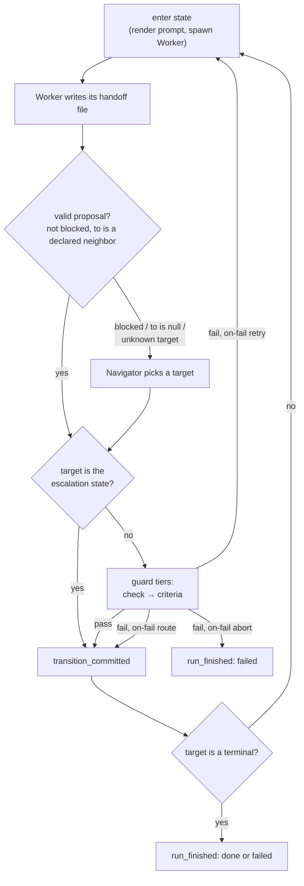

# How a run works

This document explains what actually happens when you type `loop run`, and how to take a run apart afterwards to find out why it did what it did.

For the machine keys mentioned here, see [customizing](03-customizing.md). For flags, env vars, and exit codes, see the [CLI reference](04-cli-reference.md). For why the system is shaped this way, see the [design notes](05-design-notes.md).

## The shape of a run

A run is one ticket, one state machine, driven to a terminal.

The states of that machine are **agent stages**. Entering a state means rendering a prompt and spawning a coding agent (`pi`) as a subprocess in your project directory. The agent works, then ends its stage by writing a handoff file naming where it thinks the run should go next.

That call is a **proposal**, not a move. The harness decides whether to honour it. Between the proposal and the commit sit the guards: a deterministic shell command you wrote, and an independent cheap model that reads the evidence. Only after those pass does the harness write `transition_committed` and enter the next state.

Every decision, spawn, verdict, and commit is appended to a JSONL ledger. There is no mutable state file — the run's position is recomputed by folding the ledger from the top on every step. That is also what makes the run resumable after a crash.



Two things in that diagram are easy to miss and matter a lot:

- A commit to the **escalation state bypasses every guard tier**. It does not need a declared transition — edge selection never runs for it.
- An `on-fail` **route also bypasses every guard tier** — and its backoff.

## One stage, start to finish

This is the exact ordered sequence the engine runs. Everything else in this document is a detail hanging off one of these steps.

The engine's outer loop reads the whole ledger, folds it into a run state, and dispatches on the resume point it derives from the ledger's tail. If the folded status is already finished, it returns immediately. If there is no `run_started` event yet, it appends one. Then:

**Entering a state**

1. **Terminal check.** If the state is a terminal, the run finishes here. The status is `Failed` if that terminal is the machine's `:escalation-state`, and `Done` otherwise.
2. **Budget check — before any process is spawned.** A breach appends a fatal `error` and `run_finished{status: aborted}` and stops.
3. **Compute `cycle` and `attempt`.** `cycle` is only meaningful for loop heads; every other state gets `1`. `attempt` is the count of prior attempts at this state in this cycle, plus one.
4. **Look up a pending Navigator addendum** — the `entry_prompt` the Navigator wrote when it redirected the run here, found by scanning back from the commit through that routing decision's own events. It reaches the stage prompt as `$ENTRY_ADDENDUM`.
5. **Build the stage.** Resolve the stage prompt, resolve the skill list, and render the prompt by substituting `$VAR` template variables into the stage prompt body.
6. **Append `state_entered`** — state, cycle, attempt, model, thinking, the resolved skill names, the MCP server names.
7. **Spawn the Worker** and stream-parse its stdout.
8. **If the process itself failed** (non-zero exit, spawn error), append a transient `error` and return; the fold will re-enter the state. After `MAX_CRASH_ATTEMPTS = 3` consecutive crashes the engine appends a `note` and escalates. The `error` carries the tail of pi's stderr, so a spawn failure leaves a diagnosis rather than just an exit code.
9. **Capture artifacts** claimed in the handoff — copy into the store. This happens _before_ the output event is written. A claim that cannot be resolved is recorded as an `error` and dropped; the rest proceed.
10. **Append `worker_output`** — the last non-empty assistant message as the summary, the captured artifact refs, and token/cost usage.
11. **If no proposal was emitted**, synthesize one: `{to: null, blocked: true, rationale: "worker ended its turn without writing a usable handoff file"}`.
12. **Append `transition_proposed`.**
13. **Re-read and re-fold the ledger**, then route the proposal.

**Routing the proposal**

1. **Decide whether the Navigator is needed.** It is, if `blocked` is true, or `to` is null, or `to` is not a declared neighbor of the current state.
2. **If so, invoke the Navigator.** It picks a target or escalates; its choice may finish the run.
3. **If the target is `escalate` or the escalation state, escalate directly** — no edge selection, no guard tiers. `escalate` is the sentinel the Navigator names when nothing reachable fits, and the one the harness substitutes when a Navigator reply is unusable; it resolves to the machine's escalation state, or aborts the run if none is declared.
4. **Select the edge.** The first `:transitions` entry matching `(from, to)` wins; duplicates after it are dead (`loop validate` flags them). A target that matches no edge is unreachable by construction — the Navigator can only pick from the states it was offered — so no match is recorded as `error{fatal}` and escalates.
5. **Run the guard pipeline** — check, then criteria.
6. **Append `guard_checked`** with each tier's outcome, the check's captured output, and the Judge's rationale.
7. **Fail → handle `:on-fail`. Pass → commit.**

**Committing**

If the target is a loop head and entering it would exceed that loop's `:max-cycles`, the exhaustion path runs instead. Otherwise the engine appends `transition_committed`, and _then_ sleeps the edge's `:backoff-s` — the event is durable before the sleep starts.

## The three roles

Every role is the same binary: `pi`, spawned as `pi --print --mode json` with stdin closed and stdout piped and parsed line by line. The binary comes from `LOOP_PI_BIN` (default `pi`). The working directory is always your project directory. **stderr is drained and its last 20 lines are kept** in all three cases — folded into the `error` event on a Worker crash, and into the fail-closed rationale of a Judge or Navigator that produced no marker. `loop run --verbose` echoes it live as well.

They differ in what they are allowed to do.

### Worker

The Worker is the stage. It does the actual work: reads files, edits code, runs tests, whatever the stage prompt tells it to. It is the only role with real capability, and the only one that can see your repository.

Its model comes from the resolution chain documented in [customizing](03-customizing.md#model-resolution); the last resort is the machine's `:worker`, over a built-in floor of `claude-sonnet-5` at `medium` thinking.

```
--print --mode json
[--session-id <id>]
--provider <p> --model <model>:<thinking>
--no-skills
--skill <path>            (repeated, one per resolved skill)
--append-system-prompt <path-to-rendered-stage prompt>
<entry message>           (positional, last)
```

Environment it receives: `LOOP_HANDOFF` (the absolute path this spawn writes its proposal to) and the four scalars `TICKET_ID`, `STATE`, `CYCLE`, `ATTEMPT`. `PI_AGENT_DIR` is deliberately _not_ set, so pi's `mcp` extension reads your own `~/.pi/agent/mcp.json`.

Note what is **absent** from that flag list: no `--no-builtin-tools`, no `--no-extensions`, and no `-e`. The Worker keeps bash, file editing, and pi's ambient extension discovery. Only skills are pinned shut, via `--no-skills` plus an explicit `--skill` per resolved skill.

> Withholding a skill bounds **instructions, not capability**. A stage that isn't given the `deploy` skill has no idea how you deploy — but it still has bash. Skills shape what an agent knows to do, not what it is able to do.

### Judge

The Judge evaluates one edge's `:criteria` against the evidence the harness hands it. It is a second opinion on whether the Worker actually did what it claims, and it is deliberately cheap: `claude-haiku-4-5` at `low` thinking by default.

```
--print --mode json --no-session
--provider <p> --model <m>:<t>
--no-builtin-tools --no-extensions --no-skills
--append-system-prompt <the reply contract + the criteria, as TEXT>
<judge message>
```

The only environment variable it gets is `LOOP_MOCK_ROLE`. No `LOOP_HANDOFF`, no `TICKET_ID`.

`--no-builtin-tools --no-extensions --no-skills` is the whole point, and there is no `-e` adding one back. The Judge has **no tools at all**. It cannot read a file, run bash, or reach an MCP server — which is also why its answer is prose rather than a file it writes. **It judges only what it is handed**, which is:

- the Worker's summary, trimmed
- each artifact as `- <name> (<absolute path>)`
- when a `:check` ran, its output under a literally-prefixed block: `Output of the harness's own check for this transition (the worker did not produce this, and it exited zero):`

That block is the one piece of evidence on the line the Worker did not author.

### Navigator

The Navigator is the recovery path. It fires only when the Worker's proposal is unusable, reads the ledger digest, and picks a target from the declared neighbors — or escalates. Same cheap default as the Judge: `claude-haiku-4-5` at `low`.

Same isolation flags as the Judge, and equally tool-less. Its `--append-system-prompt` receives the reply contract followed by the **graph summary**, built to this grammar:

```
## States
- `<id>` — <description>          (or `(no description)`)
- `<terminal>` — terminal

## Edges out of `<from>`
- `<from>` → `<to>` (check: <first line of check>; criteria: <first line of criteria>)
```

Each edge shows only the **first line** of its check and criteria. This is why writing `:description` on your states is worth the keystrokes — it is what the Navigator reads when it decides where a stuck run should go.

Its positional message is the ledger digest plus, when available, `Worker rationale: …`, ` (worker reported blocked)`, and ` (worker proposed: <to>)`.

The states it may name are exactly `machine.neighbors(from)` plus the literal `escalate`, listed in the prompt and enforced by the parser.

## The handoff protocol

No tools are injected into any spawn. Each role answers in the narrowest shape that role is capable of producing, and the harness reads it back after the process exits.

| Role | How its answer arrives | Read by |
| --- | --- | --- |
| Worker | JSON written to `$LOOP_HANDOFF` | `serde_json`, as a `Proposal` |
| Judge | `PASS`/`FAIL` on the first line of its final message | exact token match |
| Navigator | a state name on the first line of its final message | exact match against the offered states |

The Worker gets a file because it has a `write` tool and a summary worth keeping separate from its decision. The other two have **no tools at all** — that isolation is the point of them — so they answer in prose, against a contract stated at the top of their system prompt.

Nothing is scraped off tool results. The stream parser reads only the session id, the usage totals, and the final assistant text.

### The Worker's handoff

The harness appends an **Ending this stage** section to every rendered Worker prompt, naming the file and listing the valid targets. The same path is exported as `$LOOP_HANDOFF`, so a skill's script can write the handoff on the agent's behalf.

```json
{
  "to": "<next state>",
  "blocked": false,
  "rationale": "why this is the right next step",
  "artifacts": [{ "name": "diff", "path": "relative/path.patch" }]
}
```

| Field       | Type                           | Required  |
| ----------- | ------------------------------ | --------- |
| `to`        | state id, or `null`            | optional* |
| `blocked`   | bool, default `false`          | optional* |
| `rationale` | string                         | **yes**   |
| `artifacts` | `[{name, path}]`, default `[]` | optional  |

\* A handoff with neither `to` nor `blocked: true` parses, and is routed exactly as a proposal naming an unknown target is: to the Navigator.

The file lives at `<project>/.loop/run/<state>-<cycle>-<attempt>-handoff.json` — one per attempt, and **deleted before the spawn starts**. Both together are what stop a previous attempt's decision from being read as this one's. Writing it more than once is harmless; the last write is what the harness reads.

A readable handoff causes: the artifacts to be captured, `worker_output` and `transition_proposed` to be appended, and the routing pass to begin. `to` is checked against the current state's declared neighbors — naming something else does not create an edge, it routes to the Navigator.

### The Judge's verdict

First non-empty line is `PASS` or `FAIL`, alone. Everything after it is the rationale, stored on the `guard_checked` event as `judge_rationale`.

Blank leading lines, surrounding whitespace, backticks, `**bold**`, and a trailing colon are stripped before matching. A preamble sentence is **not** tolerated: `Let me assess this.\nPASS` is not a verdict, and fails closed.

### The Navigator's choice

First non-empty line is one of the states it was offered — `machine.neighbors(from)` plus the literal `escalate` — matched case-insensitively through the same decoration. Everything after it becomes `$ENTRY_ADDENDUM` in the next stage's prompt.

Matching is otherwise exact: no prefix matching, no fuzzy fallback. A first line naming anything else escalates.

The addendum reaches the next stage by the harness scanning back from the commit through the events of that one routing decision, so it survives the `guard_checked` a guarded route puts in between. The scan stops at the previous commit or state entry, which is what keeps a note from an earlier cycle out of a later stage's prompt.

**Fail-closed on a missing answer.** If a role's process finishes without producing a usable answer, the harness does not guess:

| Role | Missing or off-contract answer becomes |
| --- | --- |
| Worker | no proposal → the engine synthesizes `blocked: true` → the Navigator fires |
| Judge | `{pass: false, rationale: "judge returned no usable verdict"}`, plus what it actually said and the stderr tail |
| Navigator | `{to: "escalate"}`, same |

A **non-zero exit invalidates a Judge's or Navigator's answer even if one was present**. The Worker's non-zero exit is handled by the crash path instead (step 8 above), and a crashed stage's handoff is ignored along with the rest of it.

The Judge's and Navigator's fallbacks quote the reply, truncated to 400 characters. Without that, a run that stalls because a cheap model drifted off-format records only "no usable verdict" and gives you nothing to fix.

## Guards

Two tiers, evaluated in order, cheapest first:

| # | Tier | What it is | Skipped when |
| --- | --- | --- | --- |
| 1 | `check` | the edge's `:check` shell command | the edge has no `:check` |
| 2 | `criteria` | the Judge, against the edge's `:criteria` | the edge has no `:criteria` |

There is no third, structural tier in the record. The edge _is_ required to exist in `:transitions` — that is what step 4 above enforces — but enforcing it is edge selection's job, and a tier that could only ever be recorded as `pass` was a field in every `guard_checked` that carried no information.

`skip` counts as passing. A report passes when **no tier failed**.

**A failed `check` short-circuits: the Judge is never spawned.** That ordering is deliberate — you don't pay for a model call to evaluate a diff whose test suite just went red.

An edge with neither `:check` nor `:criteria` commits the Worker's proposal unexamined. `loop validate` emits a warning for exactly this, and warnings alone still exit 0.

**How a check command is executed:**

- The command string goes through the same `$VAR` substitution as a stage prompt body, so `$TICKET_ID`, `$STATE`, `$CYCLE`, `$ATTEMPT`, `$ARTIFACT_<NAME>` and the rest are all available. The four scalars `TICKET_ID`, `STATE`, `CYCLE`, `ATTEMPT` are _also_ exported as real environment variables to the subprocess.
- It is run as **`bash -c <cmd>`** — bash specifically, not `sh`, not your login shell. No profile is sourced.
- Working directory is the project directory. Stdin is null.
- **stdout and stderr are merged** into one temp file, so a failing command's error message is captured alongside its output.
- The engine polls for exit every 50 ms until the deadline.
- Default timeout is **120 seconds**; override per-edge with `:check {:cmd "…" :timeout-s N}`. On timeout the process is killed, the exit code is recorded as absent, and `\n[check timed out after {N}s]` is appended to the output.
- `passed = !timed_out && exit_code == 0`. **A non-zero exit is a normal guard failure, not a harness error.**
- The captured output is truncated to the **last 16 KiB**, prefixed with `[… N earlier bytes truncated …]\n`, then trimmed. Put the signal at the end of your command's output, not the beginning.

That truncated output is stored on `guard_checked.check_output` and, when the check passed, forwarded to the Judge.

## When a guard fails

Whichever tier failed, the edge's `:on-fail` decides what happens. It is a property of the edge, not of the tier.

| `:on-fail` | Behavior |
| --- | --- |
| `"retry"` (default) | Re-enter the **source** state at `attempt + 1`, same cycle — up to the edge's `:max-attempts`, then escalate. |
| `"abort"` | Finish the run immediately as `Failed`. |
| `{:route "x"}` | Commit straight to `x`. |

Two consequences worth internalizing:

- **A retry does not consume `max_transitions`, and `:max-cycles` cannot bound it either.** No `transition_committed` is written, so the transition budget is untouched — and because a loop head's cycle counter only advances on a committed transition, a stage retrying itself stays in cycle 1 forever no matter how tight `:max-cycles` is. What bounds a thrashing stage is the edge's own **`:max-attempts`** (default 3): once the source state has failed that edge that many times in one cycle, the run escalates and records a fatal naming the bound. Without it a `:check` that cannot pass — pointed at a missing tool, say — re-spawned the stage until the dollar budget aborted the run, which measured at 200 spawns of one stage against the bundled machine's `$8`.
- **A route skips every guard tier and the backoff.** It is an unconditional jump. The edge you route _to_ is not consulted, is not required to exist in `:transitions`, and nothing evaluates whether the destination is a sensible place to be. Routes are also **not counted** by `loop validate`'s terminal-reachability analysis, so a machine that only reaches its terminal via routes will still be flagged as having no path to a terminal.

On a retry, the whole stage runs again: fresh prompt render, fresh spawn, fresh session. Nothing from the failed attempt is carried into the next one except what is visible in the ledger digest.

## Loops and cycles

A `:loops` entry names a set of states and a cycle budget:

```fennel
:loops [{:name "fix"
         :states ["implement" "review" "test"]
         :max-cycles 4
         :on-exhausted "escalate"}]
```

**`states[0]` is the loop head.** Only the head counts cycles: entering `implement` for the third time makes it cycle 3, and every other state in the loop reports the head's current cycle. States outside any loop are always cycle 1.

`:max-cycles` is enforced **prospectively, in `commit`** — the check runs when the target of a commit is a loop head, _before_ the commit is appended. So the run never actually enters the (N+1)th cycle; it fails at the boundary.

Exhaustion appends a fatal `error`:

```
loop `fix` exhausted max_cycles=4 at head `implement`
```

and then does what `:on-exhausted` says — `"escalate"` (the default) or `"abort"`.

`loop validate` checks that each loop declares states, that every named state exists, and that the head is actually re-entered by some transition. A head nothing points back to is a loop that can never cycle, and is an error.

## Escalation

`:escalation-state` is the machine's designated failure destination. Committing to it bypasses edge selection and every guard tier — it does not need a declared transition from anywhere.

It fires on:

| Trigger                                                        | Where       |
| -------------------------------------------------------------- | ----------- |
| Navigator invocation cap exceeded                              | routing     |
| Edge selection found no matching transition                    | routing     |
| A loop exhausted `:max-cycles` with `:on-exhausted "escalate"` | commit      |
| 3 consecutive Worker process crashes                           | stage entry |

The Navigator's cap (`:max-invocations`, default 5) applies **both run-wide and per source state**. Hitting either limit means no Navigator spawn at all — the run escalates immediately. A Navigator spawn whose first line names nothing on the list is coerced to `{to: "escalate"}`, with what it said and the spawn's stderr tail as the addendum so the escalation says why.

**Landing on the escalation state reports `Failed`, not `Done`** — even though it is a terminal like any other. That is the whole reason it is declared separately: it lets a machine have a "give up here" terminal that a script can distinguish from success by exit code alone.

**With no `:escalation-state` configured, an escalation ends the run as `Aborted`.**

## Budgets

Three limits, from loop's built-in floor, optionally tightened by the machine's `:budgets` (per-field minimum — a machine can never raise a limit) and further by `--max-transitions` on the command line (also tightening only).

| Limit | Default | Comparison |
| --- | --- | --- |
| `:usd` | 15.0 | breach when `cost_usd > usd` (strictly greater) |
| `:wallclock-s` | 7200 | breach when `elapsed_s > wallclock_s` (strictly greater) |
| `:max-transitions` | 60 | breach when `transitions >= max_transitions` (greater-or-equal) |

They are checked in that order, first-wins. A breach appends a fatal `error` with a detail string plus `run_finished{status: aborted}`. **A budget breach is always `Aborted`, never `Failed`.**

Budgets are sampled at exactly two points: the top of stage entry — before any process is spawned — and on a crash-resumed guard check. Which produces two honest caveats (Worker, Judge, and Navigator spend all count toward `:usd`, and `:wallclock-s` accumulates across resumes):

- **Retries are free against `max_transitions`,** which counts committed transitions only.
- **Budgets are sampled between stages.** A single long Worker spawn can blow through the wallclock limit and will not be noticed until it finishes.

## The ledger

`<project>/.loop/ledger.jsonl`. Newline-delimited JSON, one event per line, append-only. This is the entire durable state of a run, and it lives beside the machine that produced it — there is no global state directory it could be anywhere else.

**The envelope is minimal:** every line is `ts` — RFC-3339 UTC with millisecond precision and a `Z` suffix — plus `type`, with all payload fields **flattened onto the same object**. There is no `seq`, no run id, no schema version. Ordering is file order.

```json
{
  "ts": "2026-07-26T14:03:11.482Z",
  "type": "transition_committed",
  "from": "implement",
  "to": "review",
  "cycle": 1
}
```

| `type` | Fields | Written when |
| --- | --- | --- |
| `run_started` | `ticket`, `machine_hash`, `budgets{usd,wallclock_s,max_transitions}` | first step of a run |
| `state_entered` | `state`, `cycle`, `attempt`, `session_id`, `model`, `thinking`, `skills[]`, `mcp[]` | immediately before spawning the Worker |
| `worker_output` | `state`, `cycle`, `summary`, `artifacts[{name,path}]`, `usage{tokens,cost_usd}` | after a clean Worker exit, after artifact capture |
| `transition_proposed` | `from`, `to` (nullable), `blocked`, `rationale` | right after `worker_output` |
| `guard_checked` | `from`, `to`, `check`, `criteria` (each `pass`\|`fail`\|`skip`), `check_output`, `judge_rationale`, `usage{tokens,cost_usd}` (the Judge's, zero when no criteria ran) | after the guard tiers run |
| `navigator_invoked` | `from`, `proposal`, `chosen_to`, `entry_prompt`, `usage` | when the Navigator fires |
| `transition_committed` | `from`, `to`, `cycle` | after guards pass, or on a route or escalation |
| `error` | `state`, `kind` (`transient`\|`fatal`), `detail` | budget breach, loop exhausted, Worker crash, dropped artifact claim |
| `note` | `text` | 3 crashes → escalating; otherwise a human annotation slot |
| `run_finished` | `status` (`done`\|`failed`\|`aborted`), `terminal_state`, `totals{cost_usd,tokens,wallclock_s,transitions}` | terminal |

### The ledger is a record, not a transcript

Two different things are being kept, and it matters which one you are reading.

The **ledger** is loop's own concise account of the run: decisions, evidence, spend. `worker_output.summary` is the Worker's digest of its own turn, not a log of it — the fields above are the whole schema, and there is deliberately no room in them for messages or tool calls.

The **transcript** is pi's. Every Worker spawn gets `--session-id <ticket>-<state>-<cycle>-<attempt>` (see [Worker](#worker)), and pi persists that session with the assistant messages, tool calls, tool results, commands, usage, and branching in it. `state_entered.session_id` is the only link between the two, and it is the entire reason it is on the line: loop stores the id so it never has to store the history.

Judge and Navigator spawns are sessionless on purpose (`--no-session`) — an independent verdict that leaves a resumable session behind is one more thing to accidentally continue — so they have no `session_id` and cannot be reopened.

`loop sessions` and `loop session` are how you cross from one to the other.

Every line also carries `elapsed_s`: the run's accumulated wallclock at the moment it was written, summed across every process that has driven this ledger. That is what lets `loop resume` keep counting instead of handing the run a fresh time budget — `ts` alone cannot, since the gap between an interrupted run and its resume is time during which nothing was running.

**Durability.** The file is opened once with append mode and held open. Each append stamps `ts` and `elapsed_s`, writes the line and its newline in a single `write_all`, then `sync_data()` — an fsync per event. Lines are never rewritten. A power cut loses at most the event currently being written.

**Torn-tail repair.** Opening the ledger truncates the file back to the end of its last whole line, then fsyncs the truncation. The operation is idempotent. On read, an unparseable **last** line is silently discarded; an unparseable **interior** line is a hard error:

```
corrupt ledger line 47 of /proj/.loop/ledger.jsonl: …
```

**State is folded, never stored.** Where the run is, how many cycles a loop has burned, how many attempts a state has had, what it has cost, which artifacts exist, where to resume — all of it is recomputed by replaying the ledger from the top on every engine step. Deleting the ledger starts over; there is nothing else to clean up. The fold `break`s at `run_finished`, so nothing written after a terminal event is ever read.

`totals.wallclock_s` folds out of the last event's `elapsed_s`, so it is meaningful for a run in progress and not only after `run_finished`.

## Inspecting a run

Five views over the same ledger, in increasing depth: `recap` narrates the whole run, `status` folds it to one screen, `logs` prints the events, `--raw | jq` queries them, and `session` opens the Worker transcript behind any of it.

### `loop recap`

```
loop recap
loop recap > run-recap.md
```

The deterministic post-run report. Markdown on stdout, four sections: **Run summary**, **Attempt timeline** (one section per `state_entered`, in ledger order), **Why it ended**, and **Inspecting further**.

It is a report _over_ the ledger, not another state or history store. Nothing is written; no LLM is involved; the machine is not consulted for anything the ledger already knows. The same ledger renders byte-identical output every time, which is the property that makes it usable as evidence.

**Evidence labels.** The attempt timeline attributes every claim to whoever made it, because the three sources are not equally trustworthy and the interesting runs are the ones where they disagree:

| Label | Who authored it | What it proves |
| --- | --- | --- |
| `**Worker**` | the Worker itself, from `worker_output.summary` | nothing on its own — it is the agent's own account of its own work |
| `**Proposal**` | the Worker (or the Navigator, when it routed) | what was asked for, not what was granted |
| `**Check**` | the harness, running the edge's `:cmd` in its own process | a real signal — the Worker never touched this |
| `**Judge**` | an independent Judge spawn with no tools and no session | a second opinion on the criteria, from something that did not do the work |
| `**Committed**` | the harness | what actually happened |

Artifact lines are Worker claims too: the harness captured the file the Worker pointed at, and captures nothing about whether it says what the Worker said it says.

**Partial runs.** Completion is not required. A run still in flight, or one killed mid-stage, is reported to date: "Why it ended" carries the folded resume point and the last durable event instead of a terminal transition. Attempts that produced no `worker_output`, no session id, and no commit still get their section — a failed attempt that left nothing behind is exactly what a recap is for. An **empty ledger is an error**, not an empty report.

**The machine is optional, and only sometimes trusted.** `machine.fnl` is loaded opportunistically and used _only_ when its hash still equals the `machine_hash` on `run_started`. When it differs — or when it will not load, or the ledger has no `run_started` — the recap says so, drops the state descriptions, and falls back to the machine-agnostic fold, where the `cycles` figure counts re-entries of every state rather than declared loops. A machine edited after a run cannot explain decisions the run made under the old one.

### `loop status`

```
loop status
loop status --json
```

Human mode:

```
unfinished — last at `review`
  5 transition(s), $1.23, 38104 token(s), 12m3s
  cycles: implement#2, qa#1

recent:
  <ts>  <summary>
```

The header is `not started`, ``unfinished — last at `{state}` ``, or ``finished — {status} at `{state}` `` (status rendered as `Done`, `Failed`, or `Aborted`) — the same sentence `loop recap`'s `outcome:` line carries, from the same function, so the two never describe one ledger two ways. It says "unfinished" rather than "running" because status reads a ledger and nothing else: a run whose process died an hour ago is indistinguishable here from one still working, and only the first of those is honest. The `cycles:` line appears only when the machine loaded and at least one cycle has been counted. `recent:` shows the last 12 events, oldest-first within that window, each rendered as a one-line summary in one of these forms:

```
run_started <ticket>
→ <state> (cycle N, attempt M)
<state> done ($X.XX)
<from> proposes → <to>: <rationale, 60 chars>
<from> blocked: <rationale, 60 chars>
guard <from>→<to>: check=Pass criteria=Skip
navigator <from> → <chosen_to>
committed <from> → <to>
error (Transient): <detail, 60 chars>
note: <text, 70 chars>
run_finished Done
```

`--json` emits exactly five keys:

```json
{
  "current": "done",
  "cycles": {
    "qa-staging": 3
  },
  "navigator_invocations": 0,
  "status": "done",
  "totals": {
    "cost_usd": 3.58,
    "transitions": 10,
    "wallclock_s": 3414
  }
}
```

(Real output from [the worked example](../examples/), a finished run. Keys come out alphabetically ordered.)

`status` is `null` while the run is in progress; `totals.wallclock_s` is live. There is no resume point, no artifact list, and no ticket id in JSON mode; for those, read the ledger.

On a ledger with zero events, `--json` emits the same five keys with nulls and zeroes — the plain-text ``no run yet — `loop run` starts one`` belongs to the human mode only, so JSON output is always parseable.

### `loop logs`

For an event-by-event view without the `recent:` wrapper:

```
loop logs
loop logs -n 50
```

Human mode prints the last 20 events by default, oldest first within the selected tail. Each line contains the event timestamp and the same summary grammar as `loop status`. It prints ``no run yet — `loop run` starts one`` for an empty ledger and does not require `machine.fnl` to load.

Use `--raw` when a complete, machine-readable ledger is needed:

```
loop logs --raw | jq '…'
```

Raw mode emits the entire repaired ledger as JSONL, byte-for-byte, with no heading or status text. It is the path-independent replacement for reading `.loop/ledger.jsonl` directly; an empty ledger emits zero bytes. `--raw` and an explicit `-n` cannot be combined.

### `loop sessions` and `loop session`

```
loop sessions                          # every Worker attempt, oldest first
loop sessions implement                # only attempts at that exact state
loop session PROJ-1-implement-1-2      # reopen that attempt
loop session --latest implement        # newest implement attempt, no id needed
loop session --latest                  # newest Worker attempt
```

`sessions` finds the transcript; `session` opens it. `status` and the ledger tell you what was decided; this pair is how you read what was actually said.

They read nothing but the ledger. Every candidate is a `state_entered` with a non-empty `session_id`; `session` then runs `pi --session <id>` in the project directory and hands over stdin, stdout, and stderr untouched. Neither a loadable machine nor a resolvable stage prompt is required — a mid-edit `machine.fnl` is often exactly when you want this.

**The listing is a pipeline, not a menu.** One line per attempt, in ledger order, padded into columns:

```
2026-07-26T12:01  implement        1  1  crashed     PROJ-9-implement-1-1        error: executor lost
2026-07-26T12:03  implement        1  2  finished    PROJ-9-implement-1-2        Added the retry guard and updated the tests.
2026-07-26T12:05  review-the-diff  1  1  incomplete  PROJ-9-review-the-diff-1-1
```

Timestamp, state, cycle, attempt, outcome, session id, evidence. Every field but the last is a single whitespace-free token, so field 6 is the session id in every row no matter how wide the state names got, and the evidence — the Worker's own summary, else the recorded error — trails at the end because it is the only field that can contain spaces. There is no header line and nothing is written to stdout but rows.

That is what makes the shell the picker, and it is also why there is no longer one built in:

```sh
loop sessions | fzf | awk '{print $6}' | xargs loop session
loop sessions | awk '$5=="incomplete"'
loop sessions implement | grep crashed
```

An optional positional state is an **exact filter** — `implement` never matches `implement-hotfix`.

Three things `session` will not do quietly:

- **Guess which attempt you meant.** Without `--latest` it needs an id, and an id it does not hold is an error naming `loop sessions`. `loop session implement` — the invocation the old picker took — says that `implement` is a state and gives you the two commands that work.
- **Hide a missing session.** It passes `--session`, not `--session-id`, so a session pi no longer holds is an error. `--session-id` would create an empty replacement under the same id, which looks identical to a Worker that did nothing.
- **Pretend an attempt finished.** An attempt with no `worker_output` still opens — that is precisely the transcript you want after a crash — but it warns on stderr first, because the session may also still be running.

The three outcome labels are evidence, read off the attempt's ledger episode (its own `state_entered` up to the next one, since `worker_output` carries no attempt field):

| Label        | Means                                              |
| ------------ | -------------------------------------------------- |
| `finished`   | a matching `worker_output` landed                  |
| `crashed`    | no `worker_output`, but an `error` in the episode  |
| `incomplete` | neither — still running, or killed without a trace |

Nothing here is written: loop neither parses nor mutates pi's session files, and never copies a transcript into `.loop/`. For what the sessions themselves contain and how to navigate one once it is open, see pi's own session documentation.

`--latest` selects the last candidate in ledger order after the filter — one deterministic answer, for scripts and CI. There is no `--cycle` or `--attempt`: reaching a particular older attempt is what the listing's ids are for.

### `loop diagram`

```
loop diagram
```

Renders the machine as a mermaid state diagram on stdout, with no fences and no prose, so `loop diagram > machine.mmd` gives you a bare `.mmd` file. It is a pure function of the machine — nothing on disk is consulted beyond the machine file itself — so a machine with a dangling stage prompt reference still draws. Output is deterministic.

This is the fastest way to check that the machine you _wrote_ is the machine you _meant_. From the bundled `standard-ticket` machine:

```
---
title: "PROJ-1487"
---
stateDiagram-v2
    %% generated by `loop diagram` from machine.fnl

    state "blocked (escalation)" as blocked
    state "open-pr" as open_pr

    [*] --> implement
    implement --> review : judge
    review --> test : judge
    test --> open_pr : judge
    open_pr --> done : judge

    %% back-edges taken when a guard fails (`:on-fail {:route ...}`)
    review --> implement : guard fails
    test --> implement : guard fails

    blocked --> [*]
    done --> [*]

    note right of implement
        loop "fix": max 4 cycles, then escalate to blocked
    end note
```

Reading it:

- Nodes get a `state "<label>" as <alias>` line only when the label differs from the alias — because the alias sanitizes non-alphanumerics to `_`. That is why `open-pr` gets an alias line and `implement` does not.
- The escalation state's label gets `" (escalation)"` appended.
- Solid edges are declared transitions, **in declaration order**. Back-edges from `:on-fail {:route …}` are grouped separately under the comment, one per distinct pair, sorted.
- `note right of <head>` blocks describe each loop.

**Edge-label grammar.** The label is a comma-joined list, built in this order:

| Fragment        | Appears when              |
| --------------- | ------------------------- |
| `check`         | the edge has a `:check`   |
| `judge`         | the edge has `:criteria`  |
| `unguarded`     | the edge has neither      |
| `wait {N}s`     | the edge has `:backoff-s` |
| `abort on fail` | `:on-fail` is `"abort"`   |

`retry` never appears — it is the default and would be noise on every edge — and a route gets its own arrow rather than a label fragment. So an edge labelled `check, judge, wait 30s` runs a command, then the Judge, then sleeps 30 seconds after committing.

### Reading the ledger directly

`loop recap` answers the common questions — what happened, in what order, and why it stopped — without any of this. Reach for `jq` when you want an aggregate the recap does not compute, or a shape only your ticket cares about.

`loop logs --raw` is the path-independent way to reach the complete ledger. The flat envelope makes `jq` the right tool. Three that earn their keep:

**What actually happened, in order:**

```sh
loop logs --raw | jq -r 'select(.type=="transition_committed")
       | "\(.ts)  cycle \(.cycle)  \(.from) -> \(.to)"'
```

**Why a guard failed** — dumps the failing tier, the check's captured output, and the Judge's rationale together:

```sh
loop logs --raw | jq -r 'select(.type=="guard_checked" and (.check=="fail" or .criteria=="fail"))
       | "=== \(.from) -> \(.to)  check=\(.check) criteria=\(.criteria)",
         (.check_output // "(no check output)"),
         (.judge_rationale // "(no judge rationale)")'
```

This is usually the first thing to run on a run that thrashed: it tells you in one screen whether the deterministic check or the Judge is the thing rejecting your Worker.

**Where the money went, per state:**

```sh
loop logs --raw | jq -s 'map(select(.type=="worker_output"))
       | group_by(.state)
       | map({state: .[0].state,
              spawns: length,
              cost: (map(.usage.cost_usd) | add)})'
```

That total covers the Workers only. `guard_checked` carries the Judge's `usage` too, so a full accounting sums `worker_output`, `guard_checked`, and `navigator_invoked` — which is exactly what the fold and the digest do.

### Artifacts

A Worker declares artifacts in its handoff as `[{name, path}]`. The harness captures them **before** `worker_output` is appended.

1. A relative path joins the project root; an absolute one is used as-is. Both the root and the source are canonicalized, and the source must start with the root. That single comparison rejects absolute escapes, `..` walks, and out-of-tree symlinks.
2. The destination is `<project>/.loop/artifacts/<state>-<cycle>-<name>`, with every component sanitized (non-`[A-Za-z0-9._-]` → `-`).
3. It is written atomically — temp file, fsync, rename.
4. The ledger records `{name (unsanitized), path (project-relative)}`.

The copy is the point: it is a **snapshot**, so cycle two rewriting `diff.patch` does not change what cycle one handed off. Later stages see each artifact as `$ARTIFACT_<NAME>` (the name uppercased) and in the digest's `## Artifacts` section. The Judge is handed the absolute paths — though, having no tools, it cannot open them. Nothing is hashed: no consumer ever checked a hash, and recording one would assert an integrity guarantee loop does not make.

Two sharp edges:

- **The extension is not preserved.** A claim named `diff` pointing at `changes.patch` lands at `.loop/artifacts/implement-1-diff` — no `.patch`. If you need the extension, put it in the claim's name.
- **An unusable claim is dropped, not fatal.** A path that was never written, or one that escapes the project root, produces an `error` event naming the claim; that one artifact is omitted and the stage's others are captured normally. The run continues, and the missing evidence surfaces at whichever guard wanted it.

### The rendered prompt

The `--append-system-prompt` file the Worker actually received is kept on disk, beside the handoff file for the same attempt:

```
<project>/.loop/run/<state>-<cycle>-<attempt>-system.md
```

(`sanitize` maps any character outside `[A-Za-z0-9_-]` to `-`. `run/` is derived and gitignored, so deleting it costs nothing but the ability to read back an old attempt's prompt.)

**This is the way to see what the agent was actually told.** Not the stage prompt source — the rendered result, with every `$VAR` already substituted. When a stage behaves as though it doesn't know the plan, open the render for that attempt and check whether `$PLAN` is in there at all.

That question comes up more than you would expect, because there is **no automatically-prepended context header**. Template variables reach the agent only where the stage prompt author interpolated them. A stage prompt that never writes `$TASK` gets no task; a stage prompt that never writes `$LEDGER_DIGEST` gets no digest. The render file is the proof.

The other half of the prompt is the positional entry message, which is not written to disk. It is short and contains **no ticket id, task, plan, or digest** — only the MCP connect instructions when the stage names servers, then:

```
You are entering **review**, cycle 2. (previous state: implement)
```

with the Navigator's addendum appended after a blank line when it routed here.

## Resuming an interrupted run

`loop resume` continues from the point the fold derives from the ledger's tail. It is the same code path as `loop run` with a resume flag; the only difference is which command refuses to act. `run` refuses on a non-empty ledger; `resume` refuses on an empty one.

The resume point comes entirely from the **last significant event**:

| Last significant event | Resumes at |
| --- | --- |
| a `run_finished` (status set) | nothing — the run is over |
| nothing, or only `run_started` | fresh, at the machine's `:entry` |
| `state_entered` | re-enter that state — **the whole stage re-runs** |
| `worker_output` | re-enter that state — **the whole stage re-runs** |
| `transition_proposed` | re-run the guards on that proposal |
| `transition_committed` | enter the committed target |

`guard_checked` and `navigator_invoked` **do not advance the tail**. A `navigator_invoked` sitting after a proposal still resumes at the guard check and re-invokes the Navigator from scratch.

**The consequence: an interrupted stage re-runs from scratch, at `attempt + 1`.** There is no partial-stage recovery. If the Worker spent twenty minutes editing files and the process died before `worker_output` was appended, those edits are still on disk — but the stage runs again from its rendered prompt with no memory of having run.

**So stages must be idempotent.** A stage that appends to a file, posts a comment, or opens a PR unconditionally will do it twice. Write stages that check before they act: "if the PR already exists, update it"; "if the migration is already applied, skip it". The ledger digest is available to the stage prompt via `$LEDGER_DIGEST`, and `$ATTEMPT` tells the agent which try this is.

A re-entry after a crash is marked: the stage prompt sees `$CRASHED` as `1` (empty on a clean entry), which is the hook for "check whether I already opened that PR" without having to infer it from `$ATTEMPT`.
