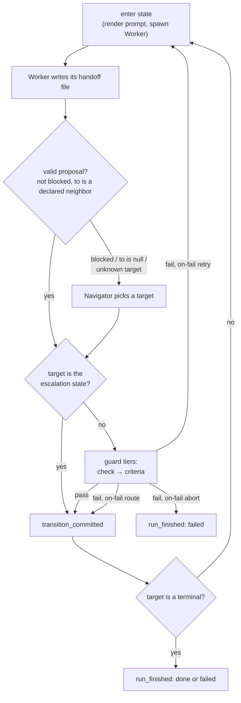

# What happens during a run

Read this when a run did something you did not expect, or when an authoring decision depends on execution order.

## The shape of a run

A run is one ticket, one state machine, driven to a terminal. Entering a state means rendering a prompt and spawning a coding agent (`pi`) as a subprocess in the project directory. The agent works, then ends its stage by writing a handoff file naming where it thinks the run should go next.

That call is a **proposal**, not a move. Between the proposal and the commit sit the guards: a deterministic shell command you wrote, and an independent cheap model that reads the evidence.

Every decision, spawn, verdict, and commit is appended to a JSONL ledger. There is no mutable state file — the run's position is recomputed by folding the ledger from the top on every step, which is also what makes the run resumable after a crash.



Two things in that diagram are easy to miss: a commit to the **escalation state bypasses every guard tier** and needs no declared transition, and an **`on-fail` route also bypasses every guard tier** — and its backoff.

## One stage, start to finish

The exact ordered sequence. The engine's outer loop reads the whole ledger, folds it into a run state, and dispatches on the resume point derived from the ledger's tail.

**Entering a state**

1. **Terminal check.** If the state is a terminal the run finishes here — `Failed` if it is the machine's `:escalation-state`, `Done` otherwise.
2. **Budget check — before any process is spawned.** A breach appends a fatal `error` plus `run_finished{status: aborted}` and stops.
3. **Compute `cycle` and `attempt`.** `cycle` is only meaningful for loop heads; every other state gets `1`. `attempt` is the count of prior attempts at this state in this cycle, plus one.
4. **Look up a pending Navigator addendum**, found by scanning back from the commit through that routing decision's own events. It reaches the stage prompt as `$ENTRY_ADDENDUM`.
5. **Build the stage.** Resolve the stage prompt, resolve the skill list, render the prompt.
6. **Append `state_entered`** — state, cycle, attempt, model, thinking, resolved skill names, MCP names.
7. **Spawn the Worker** and stream-parse its stdout.
8. **If the process itself failed**, append a transient `error` and return; the fold re-enters the state. After **3 consecutive crashes** the engine appends a `note` and escalates. The `error` carries the tail of pi's stderr.
9. **Capture artifacts** claimed in the handoff, _before_ the output event is written. An unresolvable claim becomes an `error` and is dropped; the rest proceed.
10. **Append `worker_output`** — last non-empty assistant message as the summary, artifact refs, token/cost usage.
11. **If no proposal was emitted**, synthesize `{to: null, blocked: true, rationale: "worker ended its turn without writing a usable handoff file"}`.
12. **Append `transition_proposed`.**
13. **Re-read and re-fold the ledger**, then route.

**Routing the proposal**

1. **Decide whether the Navigator is needed** — it is, if `blocked` is true, `to` is null, or `to` is not a declared neighbor of the current state.
2. **If so, invoke it.** It picks a target or escalates.
3. **If the target is `escalate` or the escalation state, escalate directly** — no edge selection, no guard tiers.
4. **Select the edge.** First `:transitions` entry matching `(from, to)` wins. No match is recorded as a fatal `error` and escalates.
5. **Run the guard pipeline** — check, then criteria.
6. **Append `guard_checked`** with each tier's outcome, the check's captured output, the Judge's rationale.
7. **Fail → handle `:on-fail`. Pass → commit.**

**Committing**

If the target is a loop head and entering it would exceed that loop's `:max-cycles`, the exhaustion path runs instead. Otherwise the engine appends `transition_committed`, and _then_ sleeps the edge's `:backoff-s` — the event is durable before the sleep starts.

## The three roles

Every role is the same binary: `pi`, spawned as `pi --print --mode json` with stdin closed and stdout parsed line by line. The binary comes from `LOOP_PI_BIN` (default `pi`). The working directory is always the project directory. **stderr is drained and its last 20 lines are kept** in all three cases.

### Worker

The stage itself. It does the actual work and is the only role with real capability or sight of the repository.

```
--print --mode json
[--session-id <id>]
--provider <p> --model <model>:<thinking>
--no-skills
--skill <path>            (repeated, one per resolved skill)
--append-system-prompt <path-to-rendered-stage-prompt>
<entry message>           (positional, last)
```

Environment: `LOOP_HANDOFF` (the absolute path this spawn writes its proposal to) plus `TICKET_ID`, `STATE`, `CYCLE`, `ATTEMPT`. `PI_AGENT_DIR` is deliberately _not_ set, so pi's `mcp` extension reads the user's own `~/.pi/agent/mcp.json`.

Note what is **absent**: no `--no-builtin-tools`, no `--no-extensions`, no `-e`. The Worker keeps bash, file editing, and ambient extension discovery. Only skills are pinned shut.

### Judge

Evaluates one edge's `:criteria` against the evidence the harness hands it — a second opinion on whether the Worker did what it claims. Cheap by default (`claude-haiku-4-5` at `low`).

```
--print --mode json --no-session
--provider <p> --model <m>:<t>
--no-builtin-tools --no-extensions --no-skills
--append-system-prompt <the reply contract + the criteria, as TEXT>
<judge message>
```

**The Judge has no tools at all.** It cannot read a file, run bash, or reach an MCP server — which is also why its answer is prose rather than a file. It judges only what it is handed:

- the Worker's summary, trimmed
- each artifact as `- <name> (<absolute path>)` — it cannot open them
- when a `:check` ran, its output under a literal prefix telling the Judge the harness produced it and that it exited zero

That block is the one piece of evidence on the line the Worker did not author. The Judge never sees the Worker's proposed target, its argument for advancing, or its session.

### Navigator

The recovery path. Fires only when the proposal is unusable, reads the ledger digest, and picks a target from the declared neighbors — or escalates. Same isolation and same cheap default as the Judge.

Its system prompt carries the reply contract followed by the graph summary:

```
## States
- `<id>` — <description>          (or `(no description)`)
- `<terminal>` — terminal

## Edges out of `<from>`
- `<from>` → `<to>` (check: <first line of check>; criteria: <first line of criteria>)
```

Each edge shows only the **first line** of its check and criteria. This is why `:description` on a state is worth the keystrokes.

The states it may name are exactly the current state's neighbors plus the literal `escalate`. Its cap (`:max-invocations`, default 5) applies **both run-wide and per source state**; hitting either means no spawn at all — the run escalates immediately.

## The handoff protocol

No tools are injected into any spawn. Each role answers in the narrowest shape it can produce.

| Role | How its answer arrives | Read by |
| --- | --- | --- |
| Worker | JSON written to `$LOOP_HANDOFF` | `serde_json`, as a `Proposal` |
| Judge | `PASS`/`FAIL` on the first line of its final message | exact token match |
| Navigator | a state name on the first line of its final message | exact match against the offered states |

### The Worker's handoff

The harness appends an **Ending this stage** section to every rendered Worker prompt, naming the file and listing the valid targets. The same path is exported as `$LOOP_HANDOFF`, so a skill's script can write the handoff on the agent's behalf.

```json
{
  "to": "<next state>",
  "blocked": false,
  "rationale": "why this is the right next step",
  "artifacts": [{ "name": "diff", "path": "relative/path.patch" }]
}
```

| Field       | Type                           | Required   |
| ----------- | ------------------------------ | ---------- |
| `to`        | state id, or `null`            | optional\* |
| `blocked`   | bool, default `false`          | optional\* |
| `rationale` | string                         | **yes**    |
| `artifacts` | `[{name, path}]`, default `[]` | optional   |

\* A handoff with neither `to` nor `blocked: true` parses, and routes exactly as an unknown target does: to the Navigator.

The file lives at `<project>/.loop/run/<state>-<cycle>-<attempt>-handoff.json`, one per attempt, and is **deleted before the spawn starts** — which is what stops a previous attempt's decision from being read as this one's. Writing it more than once is harmless; the last write wins.

`to` is checked against the current state's declared neighbors. **Naming something else does not create an edge**, it routes to the Navigator.

### The Judge's verdict

First non-empty line is `PASS` or `FAIL`, alone. Everything after it is the rationale. Blank leading lines, surrounding whitespace, backticks, `**bold**`, and a trailing colon are stripped before matching. **A preamble sentence is not tolerated** — `Let me assess this.\nPASS` is not a verdict and fails closed.

### The Navigator's choice

First non-empty line is one of the states it was offered, matched case-insensitively through the same decoration. Everything after it becomes `$ENTRY_ADDENDUM` in the next stage's prompt. Matching is otherwise exact: no prefix matching, no fuzzy fallback.

### Fail-closed on a missing answer

| Role | Missing or off-contract answer becomes |
| --- | --- |
| Worker | no proposal → the engine synthesizes `blocked: true` → the Navigator fires |
| Judge | `{pass: false, rationale: "judge returned no usable verdict"}`, plus what it actually said and the stderr tail |
| Navigator | `{to: "escalate"}`, same |

A **non-zero exit invalidates a Judge's or Navigator's answer even if one was present.** The Worker's non-zero exit goes down the crash path instead, and a crashed stage's handoff is ignored along with the rest of it. The two fallbacks quote the reply, truncated to 400 characters, so a run that stalls because a cheap model drifted off-format leaves something to fix.

## When a guard fails

| `:on-fail` | Behavior |
| --- | --- |
| `"retry"` (default) | Re-enter the **source** state at `attempt + 1`, same cycle — up to the edge's `:max-attempts`, then escalate. |
| `"abort"` | Finish the run immediately as `Failed`. |
| `{:route "x"}` | Commit straight to `x`. |

Two consequences worth internalizing:

- **A retry consumes no `max_transitions`, and `:max-cycles` cannot bound it either.** No `transition_committed` is written, so the transition budget is untouched — and because a loop head's cycle counter only advances on a commit, a stage retrying itself stays in cycle 1 forever. What bounds a thrashing stage is the edge's own **`:max-attempts`** (default 3). Without it a `:check` pointed at a missing tool re-spawned its stage until the dollar budget aborted the run — measured at 200 spawns of one stage against an `$8` budget.
- **A route skips every guard tier and the backoff.** It is an unconditional jump: the edge routed _to_ is not consulted, is not required to exist in `:transitions`, and nothing evaluates whether the destination makes sense. Routes are also **not counted** by `loop validate`'s terminal-reachability analysis, so a machine that only reaches its terminal via routes is flagged as having no path to a terminal.

On a retry the whole stage runs again: fresh prompt render, fresh spawn, fresh session. Nothing from the failed attempt carries over except what is visible in the ledger digest.

## The ledger

`<project>/.loop/ledger.jsonl`. Newline-delimited JSON, one event per line, append-only. **The entire durable state of a run.**

The envelope is minimal: every line is `ts` (RFC-3339 UTC, millisecond precision, `Z` suffix) plus `type`, with all payload fields **flattened onto the same object**. No `seq`, no run id, no schema version. Ordering is file order.

```json
{
  "ts": "2026-07-26T14:03:11.482Z",
  "type": "transition_committed",
  "from": "implement",
  "to": "review",
  "cycle": 1
}
```

| `type` | Fields | Written when |
| --- | --- | --- |
| `run_started` | `ticket`, `machine_hash`, `budgets{usd,wallclock_s,max_transitions}` | first step of a run |
| `state_entered` | `state`, `cycle`, `attempt`, `session_id`, `model`, `thinking`, `skills[]`, `mcp[]` | immediately before spawning the Worker |
| `worker_output` | `state`, `cycle`, `summary`, `artifacts[{name,path}]`, `usage{tokens,cost_usd}` | after a clean Worker exit, after artifact capture |
| `transition_proposed` | `from`, `to` (nullable), `blocked`, `rationale` | right after `worker_output` |
| `guard_checked` | `from`, `to`, `check`, `criteria` (each `pass`\|`fail`\|`skip`), `check_output`, `judge_rationale`, `usage` | after the guard tiers run |
| `navigator_invoked` | `from`, `proposal`, `chosen_to`, `entry_prompt`, `usage` | when the Navigator fires |
| `transition_committed` | `from`, `to`, `cycle` | after guards pass, or on a route or escalation |
| `error` | `state`, `kind` (`transient`\|`fatal`), `detail` | budget breach, loop exhausted, Worker crash, dropped artifact claim |
| `note` | `text` | 3 crashes → escalating; otherwise a human annotation slot |
| `run_finished` | `status` (`done`\|`failed`\|`aborted`), `terminal_state`, `totals{cost_usd,tokens,wallclock_s,transitions}` | terminal |

Every line also carries `elapsed_s`: the run's accumulated wallclock at the moment it was written, summed across every process that has driven this ledger. That is what lets `loop resume` keep counting rather than getting a fresh time budget.

**The ledger is a record, not a transcript.** `worker_output.summary` is the Worker's digest of its own turn, not a log of it. The transcript is pi's: every Worker spawn gets `--session-id <ticket>-<state>-<cycle>-<attempt>`, and `state_entered.session_id` is the only link between the two. loop stores the id so it never has to store the history. Judge and Navigator spawns are sessionless on purpose and cannot be reopened.

**Durability.** Opened once in append mode and held. Each append stamps `ts` and `elapsed_s`, writes the line and its newline in a single `write_all`, then fsyncs. Lines are never rewritten. Opening the ledger truncates a torn tail back to the last whole line; on read, an unparseable **last** line is silently discarded, while an unparseable **interior** line is a hard error.

**State is folded, never stored.** Where the run is, cycles burned, attempts made, cost, artifacts, resume point — all recomputed by replaying the ledger on every engine step. Deleting the ledger starts over; there is nothing else to clean up.

## Artifacts

A Worker declares artifacts in its handoff as `[{name, path}]`. The harness captures them **before** `worker_output` is appended.

1. A relative path joins the project root; an absolute one is used as-is. Both are canonicalized and the source must start with the root — one comparison that rejects absolute escapes, `..` walks, and out-of-tree symlinks.
2. The destination is `<project>/.loop/artifacts/<state>-<cycle>-<name>`, every component sanitized (non-`[A-Za-z0-9._-]` → `-`).
3. Written atomically — temp file, fsync, rename.
4. The ledger records `{name (unsanitized), path (project-relative)}`.

The copy is the point: it is a **snapshot**, so cycle two rewriting `diff.patch` does not change what cycle one handed off. Later stages see each artifact as `$ARTIFACT_<NAME>` and in the digest's `## Artifacts` section. Nothing is hashed.

Two sharp edges:

- **The extension is not preserved.** A claim named `diff` pointing at `changes.patch` lands at `.loop/artifacts/implement-1-diff` — no `.patch`. If you need the extension, put it in the claim's name.
- **An unusable claim is dropped, not fatal.** A path never written, or one escaping the project root, produces an `error` naming the claim; that artifact is omitted and the stage's others are captured normally.

An artifact is a durable hand-off and a record for a human. It is **not verified evidence** — the harness copies what a Worker claims and never inspects the contents, and the Judge cannot open one.

## The rendered prompt

The `--append-system-prompt` file the Worker actually received is kept on disk beside that attempt's handoff:

```
<project>/.loop/run/<state>-<cycle>-<attempt>-system.md
```

**This is the way to see what the agent was actually told** — not the stage prompt source, the rendered result with every `$VAR` already substituted. When a stage behaves as though it does not know the plan, open the render for that attempt and check whether `$PLAN` is in there at all.

The other half of the prompt is the positional entry message, which is not written to disk. It is short and contains **no ticket id, task, plan, or digest** — only the MCP connect instructions when the stage names servers, then:

```
You are entering **review**, cycle 2. (previous state: implement)
```

with the Navigator's addendum appended after a blank line when it routed here.

## Resuming

`loop resume` continues from the point the fold derives from the ledger's tail. It is the same code path as `loop run` with a resume flag; the only difference is which command refuses to act.

| Last significant event | Resumes at |
| --- | --- |
| a `run_finished` | nothing — the run is over |
| nothing, or only `run_started` | fresh, at the machine's `:entry` |
| `state_entered` | re-enter that state — **the whole stage re-runs** |
| `worker_output` | re-enter that state — **the whole stage re-runs** |
| `transition_proposed` | re-run the guards on that proposal |
| `transition_committed` | enter the committed target |

`guard_checked` and `navigator_invoked` **do not advance the tail**.

**The consequence: an interrupted stage re-runs from scratch, at `attempt + 1`.** There is no partial-stage recovery. If the Worker spent twenty minutes editing files and the process died before `worker_output` was appended, those edits are still on disk — but the stage runs again from its rendered prompt with no memory of having run.

**So stages must be idempotent.** A stage that appends to a file, posts a comment, or opens a PR unconditionally will do it twice. Write stages that check before they act. `$CRASHED` is `1` on a re-entry after a death, which is the hook for "check whether I already opened that PR" without inferring it from `$ATTEMPT`.
